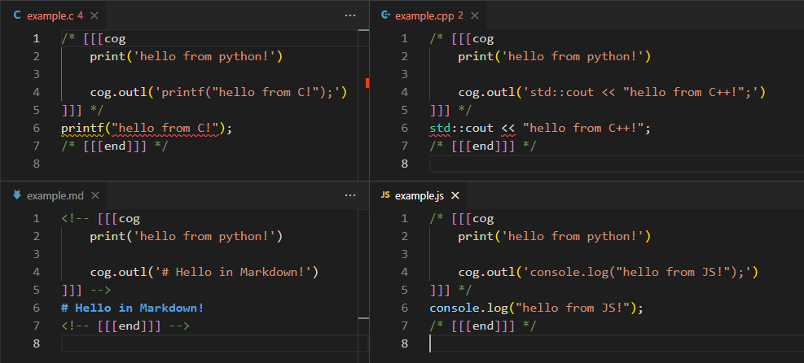

# Cog Highlighter

Adds syntax highlighting support for [Cog](https://nedbatchelder.com/code/cog/), a file generation tool written by Ned Batchelder. Cog lets you use pieces of Python code as generators in your source files to create whatever text you need.

Download on the [Visual Studio Marketplace](https://marketplace.visualstudio.com/items?itemName=DaelonSuzuka.cog) or by searching "cog" in VSCode's, extensions panel.

## Features

Adds syntax highlighting and snippets to:

- C
- C++
- JavaScript
- TypeScript
- Markdown

# Roadmap

- syntax highlighting for `cogfiles.txt`
- enable using the python language server inside cog blocks
